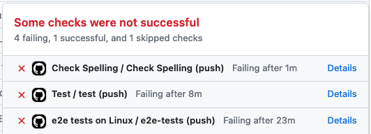

# Contributing to Rancher Desktop

Rancher Desktop accepts contributions via GitHub pull requests.
This document outlines the process to get your pull request accepted.

## Start With An Issue

Prior to creating a pull request it is a good idea to [create an issue].
This is especially true if the change request is something large.
The bug, feature request, or other type of issue can be discussed prior to
creating the pull request. This can reduce rework.

[create an issue]: https://github.com/rancher-sandbox/rancher-desktop/issues/new

## Sign Your Commits

A sign-off is a line at the end of the explanation for a commit.
All commits must be signed. Your signature certifies that you wrote the patch
or otherwise have the right to contribute the material. When you sign off you
agree to the following rules
(from [developercertificate.org](https://developercertificate.org/)):

```
Developer Certificate of Origin
Version 1.1

Copyright (C) 2004, 2006 The Linux Foundation and its contributors.
1 Letterman Drive
Suite D4700
San Francisco, CA, 94129

Everyone is permitted to copy and distribute verbatim copies of this
license document, but changing it is not allowed.

Developer's Certificate of Origin 1.1

By making a contribution to this project, I certify that:

(a) The contribution was created in whole or in part by me and I
    have the right to submit it under the open source license
    indicated in the file; or

(b) The contribution is based upon previous work that, to the best
    of my knowledge, is covered under an appropriate open source
    license and I have the right under that license to submit that
    work with modifications, whether created in whole or in part
    by me, under the same open source license (unless I am
    permitted to submit under a different license), as indicated
    in the file; or

(c) The contribution was provided directly to me by some other
    person who certified (a), (b) or (c) and I have not modified
    it.

(d) I understand and agree that this project and the contribution
    are public and that a record of the contribution (including all
    personal information I submit with it, including my sign-off) is
    maintained indefinitely and may be redistributed consistent with
    this project or the open source license(s) involved.
```

Then you add a line to every git commit message:

    Signed-off-by: Joe Smith <joe.smith@example.com>

Use your real name (sorry, no pseudonyms or anonymous contributions).

If you set your `user.name` and `user.email` git configs, you can sign your
commit automatically with `git commit -s`.

Note: If your git config information is set properly then viewing the `git log`
information for your commit will look something like this:

```
Author: John Smith <john.smith@example.com>
Date:   Thu Feb 2 11:41:15 2018 -0800

    Update README

    Signed-off-by: John Smith <john.smith@example.com>
```

Notice the `Author` and `Signed-off-by` lines match. If they don't your PR will
be rejected by the automated DCO check.

## Pull Requests

Pull requests for a code change should reference the issue they are related to.
This will enable issues to serve as a central point of reference for a change.
For example, if a pull request fixes or completes an issue the commit or
pull request should include:

```md
Closes #123
```

In this case 123 is the corresponding issue number.

### When End-To-End Tests Fail

Every pull request triggers a full run of testing in the CI system.
The failures reported by the code style checker (aka the "linter") and the unit tests are usually
clear and easy to fix (and can be avoided by running `yarn test` locally before creating a commit).
But when an integration, or e2e test, fails, it's sometimes useful to consult the log files
for the run.

1. Click on the _Details_ link next to the failing E2E test notification, and
   navigate to the summary view of the test.

   
2. From the bottom of the summary view, locate the `failure-reports.zip` link
   and download it.  (You must be logged in to GitHub to be able to download
   that file.)

   
3. Extract that file to find the logs; they are in directories named after each
   test.  For example, a subset of the log files may include:
   ```
   $ ls -l
   total 62204
   drwxr-xr-x 29 nobody nobody      928 Oct 12  2020 backend.e2e.spec.ts-logs
   -rw-r--r--  1 nobody nobody 31616936 Oct 12  2020 backend.e2e.spec.ts-pw-trace.zip
   $ ls backend.e2e.spec.ts-logs/
   background.log         k8s.log             networking.log
   commandLine.log        kube.log            protocol-handler.log
   dashboardServer.log    lima.ha.stderr.log  server.log
   deploymentProfile.log  lima.ha.stdout.log  settings.log
   diagnostics.log        lima.log            shortcuts.log
   extensions.log         lima.serial.log     steve.log
   images.log             moby.log            update.log
   integrations.log       mock.log            window_browser.log
   k3s.log                nerdctl.log         wsl.log
   ```
4. It may be useful to go to https://trace.playwright.dev/ to examine the
   Playwright traces; they are the files named `*-pw-trace.zip`.  This can be
   useful for seeing the state of the UI when waiting for elements to appear,
   disappear, etc.

## Semantic Versioning

Rancher Desktop follows [semantic versioning](https://semver.org/).

This does not cover Kubernetes or other tools provided by Rancher Desktop.
Kubernetes has its own [release versioning](https://github.com/kubernetes/community/blob/master/contributors/design-proposals/release/versioning.md#kubernetes-release-versioning)
scheme that looks like SemVer but is semantically different.
